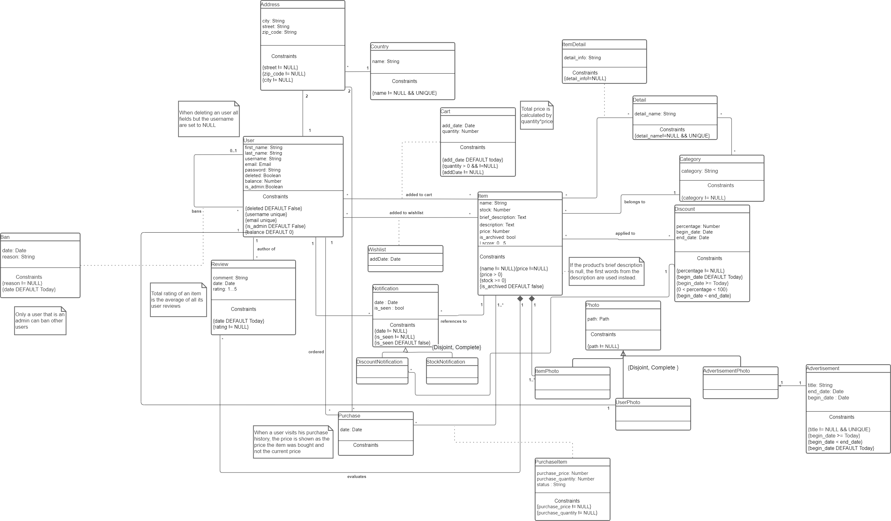

# EBD: Database Specification Component

Our website aims to help customers get what then need when they need it during these troubling times with an enjoyable browsing experience.

## A4: Conceptual Data Model

The Fneuc shop website provides a reliable shopping service for the general public with easy access.
This artefact contains the conceptual data model for the platform, including business rules.

### 1. Class diagram

  
Figure 1: Class Diagram.

### 2. Additional Business Rules


Additional business rules are represented as UML notes in the class diagram.

---


## A5: Relational Schema, validation and schema refinement

In this artifact our website's database relational schema is presented as well as it's valitation and refinements.

### 1. Relational Schema

| Relation referenct | Relation Compact Notation                                    |
| ------------------ | ------------------------------------------------------------ |
| R01                | country(<ins>country_id</ins>, name **NN**)                  |
| R02                | address(<ins>address_id</ins>, city **NN**, street **NN**, zip_code **NN**, country&#8594;country) |
| R03                | photo(<ins>photoID</ins>, path **NN**)                       |
| R04                | users(<ins>user_id</ins>, first_name , last_name, username <b>UK </b>, email <b>UK</b>, password, billing_addr&#8594;address, shipping_addr&#8594;address,photo_id&#8594;photo, deleted **DF** False) |
| R05                | admin(<ins>user_id</ins>&#8594;user)                         |
| R06                | authenticated(<ins>user_id</ins>&#8594;user, balance **DF** 0) |
| R07                | review(<ins>review_id</ins>, user_id&#8594;authenticated, comment, date **DF** Today, rating **NN CK** rating > 0 AND rating < = 5) |
| R08                | category(<ins>category_id</ins>, name **UK**)                |
| R09                | detail(<ins>detail_id</ins>, name **NN UK**)                 |
| R10                | item(<ins>item_id</ins>, name **NN**, stock **NN CK** stock >= 0, brief_description, description **NN**, price **NN CK** price> 0, isArchived **DF** False, category&#8594;category) |
| R11                | ban(<ins>admin_id</ins>&#8594;admin, <ins>user_id&#8594;</ins>authenticated, date **DF** Today, reason **NN**) |
| R12                | purchase(<ins>purchase_id</ins>, user_id&#8594;authenticated, date **DF** Today) |
| R13                | purchase_item(<ins>purchase_id</ins>&#8594;purchase, <ins>item_id</ins>&#8594;item, purchase_price **NN**, quantity **NN**) |
| R14                | advertisement(<ins>advertisement_id</ins>, title **NN UK**, begin_date **DF** Today, end_date **CK** end_date > begin_date, photo_id&#8594;photo) |
| R15                | item_photo(<ins>photo_id</ins>&#8594;photo, item_id&#8594;item) |
| R16                | cart(<ins>user_id</ins>&#8594;user, <ins>item_id</ins>&#8594;item, add_date **DF** Today, quantity **CK** quantity > 0) |
| R17                | wishlist(<ins>user_id</ins>&#8594;user, <ins>item_id</ins>&#8594;item, add_date **DF** Today) |
| R18                | discount(<ins>discount_id</ins>, percentage **CK** percentage > 0 && percentage < 100, begin_date **DF** Today, end_date **CK** end_date > begin_date) |
| R19                | notification(<ins>notification_id</ins>, user_id&#8594;user, item_id&#8594;item, discount_id&#8594;discount,date **DF** Today, is_seen **DF** False, type) |
| R20                | apply_discount(<ins>item_id</ins>&#8594;item, <ins>discount_id</ins>&#8594;discount) |
| R21                | item_detail(<ins>item_id</ins>&#8594;item, <ins>detail_id</ins>&#8594;detail, detail_info **NN**) |
| R22                | category_detail(<ins>category_id</ins>&#8594;category, <ins>detail_id</ins>&#8594;detail) |

All users' attributes must be not null when deleted is false but all but the id are null when deleted is true. Because of this, the attributes cannot have the flag not null.

### 2. Domains

| Domain Name | Domain Specification                               |
| ----------- | -------------------------------------------------- |
| Today       | DATE DEFAULT CURRENT_DATE                          |
| Status      | ENUM ('Processing', 'Delivered', 'Shipped','Lost') |

### 3. Schema validation

In this section, the functional dependencies and the normal form each table is in is presented

| **TABLE R01** | users             |
| --------------  | ---                |
| **Keys**        | { user_id } |
| **Functional Dependencies:** |       |
| FD0101          | { user_id } → { email, name, username, password, billing_addr, shipping_addr,photo_id,deleted} |
| **NORMAL FORM** | BCNF               |

| **TABLE R02**                | admin       |
| ---------------------------- | ----------- |
| **Keys**                     | { user_id } |
| **Functional Dependencies:** | None        |
| **NORMAL FORM**              | BCNF        |

| TABLE R03                    | authenticated             |
| ---------------------------- | ------------------------- |
| **Keys**                     | { user_id }               |
| **Functional Dependencies:** |                           |
| FD0301                       | { user_id } → { balance } |
| **NORMAL FORM**              | BCNF                      |

| **TABLE R0**4                | review                                             |
| :--------------------------- | :------------------------------------------------- |
| **Keys**                     | { review_id}                                       |
| **Functional Dependencies:** |                                                    |
| FD0401                       | { review_id } → { user_id, comment, date, rating } |
| **NORMAL FORM**              | BCNF                                               |

| **TABLE R05**                | category                  |
| ---------------------------- | ------------------------- |
| **Keys**                     | { category_id }           |
| **Functional Dependencies:** |                           |
| FD0501                       | { category_id} → { name } |
| **NORMAL FORM**              | BCNF                      |

| TABLE R06                    | detail                   |
| ---------------------------- | ------------------------ |
| **Keys**                     | { detail_id }            |
| **Functional Dependencies:** |                          |
| FD0601                       | { detail_id } → { name } |
| **NORMAL FORM**              | BCNF                     |

| **TABLE R07**                | item                                                         |
| ---------------------------- | ------------------------------------------------------------ |
| **Keys**                     | { item_id }                                                  |
| **Functional Dependencies:** |                                                              |
| FD0701                       | { item_id } → { name, stock, description, price, brief_description, price, is_archived, category} |
| **NORMAL FORM**              | BCNF                                                         |

| **TABLE R08**                | ban                                      |
| ---------------------------- | ---------------------------------------- |
| **Keys**                     | { admin_id, user_id }                    |
| **Functional Dependencies:** |                                          |
| FD0801                       | { admin_id, user_id } → { date, reason } |
| **NORMAL FORM**              | BCNF                                     |

| **TABLE R09**                | country                   |
| ---------------------------- | ------------------------- |
| **Keys**                     | { country_id }            |
| **Functional Dependencies:** |                           |
| FD0901                       | { country_id } → { name } |
| **NORMAL FORM**              | BCNF                      |

| **TABLE R10**                | address                                              |
| ---------------------------- | ---------------------------------------------------- |
| **Keys**                     | { address_id }                                       |
| **Functional Dependencies:** |                                                      |
| FD1001                       | { address_id } → { city, street, zip_code, country } |
| **NORMAL FORM**              | BCNF                                                 |

| **TABLE R11**                | purchase                   |
| ---------------------------- | -------------------------- |
| **Keys**                     | { purchase_id }            |
| **Functional Dependencies:** |                            |
| FD1101                       | { purchase_id } → { date } |
| **NORMAL FORM**              | BCNF                       |

| **TABLE R12**                | purchase_item                                           |
| ---------------------------- | ------------------------------------------------------- |
| **Keys**                     | { purchase_id, item_id }                                |
| **Functional Dependencies:** |                                                         |
| FD1201                       | { purchase_id, item_id } → { purchase_price, quantity } |
| **NORMAL FORM**              | BCNF                                                    |

| **TABLE R13**                | photo                   |
| ---------------------------- | ----------------------- |
| **Keys**                     | { photo_id }            |
| **Functional Dependencies:** |                         |
| FD1301                       | { photo_id } → { path } |
| **NORMAL FORM**              | BCNF                    |

| TABLE R014                   | advertisement                                            |
| ---------------------------- | -------------------------------------------------------- |
| **Keys**                     | { advertisement_id }, { title }                          |
| **Functional Dependencies:** |                                                          |
| FD1401                       | { advertisement_id} → { title, begin_date,  end_date }   |
| FD1402                       | { title } -> { advertisement_id, begin_date,  end_date } |
| **NORMAL FORM**              | BCNF                                                     |

| TABLE R015                   | item_photo                 |
| ---------------------------- | -------------------------- |
| **Keys**                     | { photo_id }               |
| **Functional Dependencies:** |                            |
| FD1501                       | { photo_id } → { item_id } |
| **NORMAL FORM**              | BCNF                       |

| TABLE R016                   | cart                                               |
| ---------------------------- | -------------------------------------------------- |
| **Keys**                     | { user_id, item_id }                               |
| **Functional Dependencies:** |                                                    |
| FD1601                       | { user_id, item_id } → { add_date, is_seen, type } |
| **NORMAL FORM**              | BCNF                                               |

| TABLE R017                   | wishlist                            |
| ---------------------------- | ----------------------------------- |
| **Keys**                     | { user_id, item_id }                |
| **Functional Dependencies:** |                                     |
| FD1701                       | { user_id, item_id } → { add_date } |
| **NORMAL FORM**              | BCNF                                |

| TABLE R018                   | notification                                                 |
| ---------------------------- | ------------------------------------------------------------ |
| **Keys**                     | { user_id, item_id }                                         |
| **Functional Dependencies:** |                                                              |
| FD1801                       | { user_id, item_id } → {item_id, discount_id,date, is_seen, type } |
| **NORMAL FORM**              | BCNF                                                         |

| TABLE R019                   | discount                                      |
| ---------------------------- | --------------------------------------------- |
| **Keys**                     | { id }                                        |
| **Functional Dependencies:** |                                               |
| FD1901                       | { id } → { percentage, begin_date, end_date } |
| **NORMAL FORM**              | BCNF                                          |

| TABLE R020                   | apply_discount           |
| ---------------------------- | ------------------------ |
| **Keys**                     | { item_id, discount_id } |
| **Functional Dependencies:** |                          |
| (none)                       |                          |
| **NORMAL FORM**              | BCNF                     |

| TABLE R021                   | item_detail                               |
| ---------------------------- | ----------------------------------------- |
| **Keys**                     | { item_id, detail_id }                    |
| **Functional Dependencies:** |                                           |
| FD2101                       | { item_id, detail_id } -> { detail_info } |
| **NORMAL FORM**              | BCNF                                      |

| TABLE R022                   | category_detail                           |
| ---------------------------- | ----------------------------------------- |
| **Keys**                     | { category_id, detail_id }                |
| **Functional Dependencies:** |                                           |
| FD2101                       | { item_id, detail_id } -> { detail_info } |
| **NORMAL FORM**              | BCNF                                      |


---


## A6: Indexes, triggers, user functions, transactions and population

> Brief presentation of the product.  
> Brief presentation of the artefact goals.

### 1. Database Workload

> A study of the predicted system load (database load), organized in subsections.  

#### 1.1. Tuple Estimation

> Estimate of tuples at each relation.  	

| **Relation reference** | **Relation Name** | **Order of magnitude**        | **Estimated growth** |
| ------------------ | ------------- | ------------------------- | -------- |
| R01 | country | hundreds |none|
| R02 | photo | thousands |units per day|
| R03               | address | thousands |units per day|
| R04             | users                | thousands |dozens per day|
| R05 | admins | hundred |units per month|
| R06 | authenticated | thousands |dozens per day|
| R07 | review | tens of thousands |hundreds per day|
| R08 | details | hundreds |units per year|
| R09 | category | units |units per year|
| R10 | item | thousands |units per month|
| R11 | ban | hundreds |units per week|
| R12 | purchase | thousands |units per day|
| R13 | purchaseItem | tens of thousands |dozens per day|
| R14 | advertisement | thousands |units per week|
| R15 | itemPhoto | thousands |units per day|
| R16             | cart    | tens of thousands |dozens per day|
| R17             | wishlist | tens of thousands |dozens per day|
| R18 | discount | hundred |units per month|
| R19 | notification | tens of thousands |dozens per day|
| R20 | discountNotification | thousands |dozens per day|
| R21 | stockNotification | thousands |dozens per day|
| R22 | applyDiscount | thousand |hundred per month|
| R23 | itemDetail | tens of thousands |dozens per month|
| R24 | categoryDetail | hundreds |dozens per year|


#### 1.2. Frequent Queries

> Most important queries (SELECT) and their frequency.  

| Query reference   | SELECT01          |
| ----------------- | ----------------- |
| Query description | get user info     |
| Query frequency   | thousands per day |

```sql
SELECT * FROM users WHERE user_id = $id;
```

| Query reference   | SELECT02                  |
| ----------------- | ------------------------- |
| Query description | get user shipping address |
| Query frequency   | hundreds per day          |

```sql
SELECT addr.* 
FROM users JOIN 
(
	SELECT * FROM address JOIN country USING (country_id)
) AS addr ON (users.shipping_address = addr.address_id)
WHERE users.user_id = $id
```

| Query reference   | SELECT03                 |
| ----------------- | ------------------------ |
| Query description | get user billing address |
| Query frequency   | hundreds per day         |

```sql
SELECT addr.* 
FROM users JOIN 
(
	SELECT * FROM address JOIN country USING (country_id)
) AS addr ON (users.billing_address = addr.address_id)
WHERE users.user_id = $id
```

| Query reference   | SELECT04          |
| ----------------- | ----------------- |
| Query description | sign in           |
| Query frequency   | thousands per day |

```sql
SELECT user_id FROM USER
WHERE (email = $username_or_email OR username = $username_or_email) AND password = $pwd
```

| Query reference   | SELECT05                 |
| ----------------- | ------------------------ |
| Query description | search items of category |
| Query frequency   | thousands per day        |

```sql
SELECT item.* FROM item
WHERE category_id = $cat_id AND item.is_archived = false
```

| Query reference   | SELECT06                  |
| ----------------- | ------------------------- |
| Query description | get item's info           |
| Query frequency   | tens of thousands per day |

```sql
SELECT item.item_id, details_info.detail_info, details_info.name 
FROM item 
JOIN 
(SELECT * FROM item_detail JOIN details USING (detail_id ))  AS details_info
USING (item_id)
```

| Query reference   | SELECT07                                |
| ----------------- | --------------------------------------- |
| Query description | search for an item that is not archived |
| Query frequency   | tens of thousands per day               |

```sql
SELECT *, ts_rank_cd(search, query) FROM item, to_tsquery('english', $search) AS query
WHERE search @@ query AND is_archived = false
```

| Query reference   | SELECT08                            |
| ----------------- | ----------------------------------- |
| Query description | search for an item in a price range |
| Query frequency   | tens of thousands per day           |

```sql
SELECT item.* FROM item
WHERE price < $max_price AND price > $min_price AND item.is_archived = false
```

| Query reference   | SELECT09                                              |
| ----------------- | ----------------------------------------------------- |
| Query description | search for an item in a price range within a cetegory |
| Query frequency   | tens of thousands per day                             |

```sql
SELECT item.* FROM item
WHERE price < $max_price AND price > $min_price AND category_id = $cat_id AND item.is_archived = false
```

| Query reference   | SELECT10                |
| ----------------- | ----------------------- |
| Query description | search user by username |
| Query frequency   | dozens per day          |

```sql
SELECT user FROM users
WHERE username = $usrname
```

| Query reference   | SELECT11              |
| ----------------- | --------------------- |
| Query description | get a user's wishlist |
| Query frequency   | thousands per day     |

```sql
SELECT wishlist_items.* 
FROM users JOIN 
(wishlist JOIN item USING (item_id)) AS wishlist_items
ON (wishlist_items.user_id = users.user_id)
WHERE users.user_id = $usr_id
```

| Query reference   | SELECT12          |
| ----------------- | ----------------- |
| Query description | get a user's cart |
| Query frequency   | thousands per day |

```sql
SELECT cart_items.* 
FROM users JOIN 
(cart INNER JOIN item USING (item_id)) AS cart_items
ON (cart_items.user_id = users.user_id)
WHERE users.user_id = $usr_id
```

| Query reference   | SELECT13                        |
| ----------------- | ------------------------------- |
| Query description | all detail's name of a category |
| Query frequency   | hundreds per day                |

```sql
SELECT detail_name.name
FROM category JOIN (category_detail JOIN details USING (detail_id)) AS detail_name USING (category_id) 
WHERE category.category_id = $cat_id 
```

| Query reference   | SELECT14                       |
| ----------------- | ------------------------------ |
| Query description | categories for dropdown filter |
| Query frequency   | thousands per day              |

```sql
SELECT category.name
FROM category 
WHERE category.category_id = $cat_id
```

| Query reference   | SELECT15          |
| ----------------- | ----------------- |
| Query description | get items reviews |
| Query frequency   | thousands per day |

```sql
SELECT users.username, item_reviews.comment_text, item_reviews.date, item_reviews.rating
FROM users JOIN (review JOIN item USING (item_id)) AS item_reviews USING (user_id)
WHERE item_reviews.item_id = $item_id
```

| Query reference   | SELECT16          |
| ----------------- | ----------------- |
| Query description | get items reviews |
| Query frequency   | thousands per day |

```sql
SELECT users.username, item_reviews.comment_text, item_reviews.date, item_reviews.rating
FROM users JOIN (review JOIN item USING (item_id)) AS item_reviews USING (user_id)
WHERE item_reviews.item_id = $item_id
```

| Query reference   | SELECT17                 |
| ----------------- | ------------------------ |
| Query description | get user's notifications |
| Query frequency   | thousands per day        |

```sql
SELECT notification_item.*
FROM users JOIN (SELECT notification.*, item.name AS item_name FROM notification JOIN item USING (item_id)) AS notification_item USING (user_id)
WHERE users.user_id = $usr_id
```

| Query reference   | SELECT18                  |
| ----------------- | ------------------------- |
| Query description | search for an item        |
| Query frequency   | tens of thousands per day |

```sql
SELECT * FROM items
WHERE search @@ plainto_ts_query('english', $search)
```

| Query reference   | SELECT19                   |
| ----------------- | -------------------------- |
| Query description | search for item's discount |
| Query frequency   | thousands per day          |

```sql
SELECT appliadble_discount.*
FROM item JOIN (apply_discount JOIN discount USING (discount_id)) AS appliadble_discount USING (item_id)
WHERE item.item_id = $itm_id
```

| Query reference   | SELECT20                    |
| ----------------- | --------------------------- |
| Query description | get all available discounts |
| Query frequency   | thousands per day           |

```sql
SELECT *
FROM advertisement
WHERE begin_date >= now()::date AND end_date <= now()::date
```

| Query reference   | SELECT21          |
| ----------------- | ----------------- |
| Query description | get all discounts |
| Query frequency   | thousands per day |

```sql
SELECT *
FROM advertisement
```

| Query reference   | SELECT22                |
| ----------------- | ----------------------- |
| Query description | user's purchase history |
| Query frequency   | thousands per day       |

```sql
SELECT prcs_items.*
FROM users JOIN (purchase JOIN purchase_item USING (purchase_id)) AS prcs_items USING(user_id)
WHERE users.user_id = $usr_id
```

| Query reference   | SELECT23                    |
| ----------------- | --------------------------- |
| Query description | get all of an item's photos |
| Query frequency   | thousands per day           |

```sql
SELECT item_photos.path
FROM item JOIN (item_photo JOIN photo USING (photo_id)) as item_photos USING (item_id)
WHERE item.item_id = $itm_id
```


#### 


#### 1.3. Frequent Updates

> Most important updates (INSERT, UPDATE, DELETE) and their frequency.  

| **Query**       | UPDATE01                               |
| ---             | ---                                    |
| **Description** | Update user information |
| **Frequency**   | hundred per month                     |
```sql 
UPDATE "user"
    SET first_name = $first_name, last_name = $last_name, email = $email, 
    password = $password, billingAddress = $billingAddress, 
    shippingAddress = $shippingAddress, photoID = $photoID
    WHERE userID = $userID
```

| **Query**       | UPDATE02                             |
| ---             | ---                                    |
| **Description** | Update item information |
| **Frequency**   | hundred per month                     |
```sql 
UPDATE "item"
    SET stock = $stock, brief_description = $brief_description, description = $description,
    price = $price, isArchived = $isArchived, category = $category
    WHERE itemID = $itemID
```

| **Query**       | UPDATE03                             |
| ---             | ---                                    |
| **Description** | Update cart information |
| **Frequency**   | hundred per month                     |
```sql 
UPDATE "cart"
    SET addDate = $addDate, quantity = $quantity
    WHERE userID = $userID AND itemID = $itemID
```

| **Query**       | INSERT01                           |
| ---             | ---                                    |
| **Description** | New user registered |
| **Frequency**   | dozens per day                     |
```sql 
INSERT INTO "user" (first_name,last_name,username,email,password)
    VALUES($first_name,$last_name,$username,$email,$password)
```

| **Query**       | INSERT02                           |
| ---             | ---                                    |
| **Description** | New item for sale |
| **Frequency**   | hundreds per month                     |
```sql 
INSERT INTO "item" (name,stock,brief_description,description,price,category)
    VALUES ($name,$stock,$brief_description,$description,$price,$category)
```

| **Query**       | INSERT03                           |
| ---             | ---                                    |
| **Description** | Create new review |
| **Frequency**   | hundreds per month                     |
```sql 
INSERT INTO "review" (userID,comment,date,rating)
    VALUES ($userID,$comment,$date,$rating)
```

| **Query**       | INSERT04                           |
| ---             | ---                                    |
| **Description** | Create new address |
| **Frequency**   | hundreds per month                     |
```sql 
INSERT INTO "address" (city,street,zip_code,country)
    VALUES ($city,$street,$zip_code,$country)
```

| **Query**       | INSERT05                           |
| ---             | ---                                    |
| **Description** | Ban user |
| **Frequency**   | dozens per month                     |
```sql 
INSERT INTO "ban" (adminID,userID,date,reason)
    VALUES ($adminID,$userID,$date,$reason)
```

| **Query**       | INSERT06                           |
| ---             | ---                                    |
| **Description** | Make new purchase |
| **Frequency**   | dozens per day                     |
```sql 
INSERT INTO "purchase" (purchase_id,userID,date)
    VALUES ($purchase_id,$userID,$date)
```

| **Query**       | INSERT07                           |
| ---             | ---                                    |
| **Description** | Add item to cart |
| **Frequency**   | dozens per day                     |
```sql 
INSERT INTO "cart" (user_id,item_id,add_date,quantity)
    VALUES ($user_id,$item_id,$add_date,$quantity )
```

| **Query**       | INSERT08                           |
| ---             | ---                                    |
| **Description** | Add item to wishlist |
| **Frequency**   | dozens per day                     |
```sql 
INSERT INTO "wishlist" (user_id,item_id,add_date)
    VALUES ($user_id,$item_id,$add_date)
```

| **Query**       | INSERT09                           |
| ---             | ---                                    |
| **Description** | New notification |
| **Frequency**   | dozens per day                     |
```sql 
INSERT INTO "notification" (notification_id,user_id,item_id,discount_id,date,is_seen,type)
    VALUES ($notification_id,$user_id,$item_id,$discount_id,$date,$is_seen,$type)
```

| **Query**       | DELETE01 |
| ---             | ---                                    |
| **Description** | Remove item from cart |
| **Frequency**   | dozens per day                     |
```sql 
DELETE FROM "cart"
    WHERE user_id=$user_id AND item_id=$item_id
```

| **Query**       | DELETE02 |
| ---             | ---                                    |
| **Description** | Remove item from wishlist |
| **Frequency**   | dozens per day                     |
```sql 
DELETE FROM "wishlist"
    WHERE user_id=$user_id AND item_id=$item_id
```

### 2. Proposed Indices

#### 2.1. Performance Indices

> Indices proposed to improve performance of the identified queries.  

| **Index**           | IDX01                                  |
| ---                 | ---                                    |
| **Related queries** | SELECT06                         |
| **Relation**        | item_detail    |
| **Attribute**       | "detail_id"   |
| **Type**            | Hash             |
| **Cardinality**     | High |
| **Clustering**      | No                |
| **Justification**   | Query SELECT06 that gets the details of an item is executed several times so it has to be fast; doesn't need query range support; cardinality is high so it's not a good candidate for clustering   |
```sql
CREATE INDEX item_detail_detailID ON item_detail USING hash(detail_id);
```
#### 2.2. Full-text Search Indices 

> The system being developed must provide full-text search features supported by PostgreSQL. Thus, it is necessary to specify the fields where full-text search will be available and the associated setup, namely all necessary configurations, indexes definitions and other relevant details.  

| **Index**           | IDX01                                  |
| ---                 | ---                                    |
| **Related queries** | SELECT01, ...                          |
| **Relation**        | Relation where the index is applied    |
| **Attribute**       | Attribute where the index is applied   |
| **Type**            | B-tree, Hash, GiST or GIN              |
| **Clustering**      | Clustering of the index                |
| **Justification**   | Justification for the proposed index   |
| `SQL code`                                                  ||

### 3. Triggers

> User-defined functions and trigger procedures that add control structures to the SQL language or perform complex computations, are identified and described to be trusted by the database server. Every kind of function (SQL functions, Stored procedures, Trigger procedures) can take base types, composite types, or combinations of these as arguments (parameters). In addition, every kind of function can return a base type or a composite type. Functions can also be defined to return sets of base or composite values.  

| **Trigger**      | TRIGGER01                              |
| ---              | ---                                    |
| **Description**  | Trigger description, including reference to the business rules involved |
| `SQL code`                                             ||

### 4. Transactions

> Transactions needed to assure the integrity of the data.  

| T01 | Add to Cart, update stock                                    |
| --------------- | ----------------------------------- |
| Justification   | When adding an item to the cart, the stock must be decreased, but if more than one user adds the same item simultaneously, an error can occur and so the transaction is necessary.  Repeatable Read isolation is used to avoid dirty and nonrepeatable reads, while allowing new rows to be inserted in items. |
| Isolation level | Repeatable Read |

```sql
BEGIN TRANSACTION;
SET TRANSACTION ISOLATION LEVEL REPEATABLE READ;

DO $$
BEGIN
    SELECT item_id
    FROM cart
    WHERE user_id = $user_id AND item_id = $item_id;

    IF NOT found THEN
        IF (
        SELECT stock 
        FROM item 
        WHERE item_id = $item_id) >= $quantity 
        THEN
    	    UPDATE item 
            SET stock = stock - $quantity 
            WHERE item_id = $item_id; 
    
            INSERT INTO cart
            VALUES($user_id, $item_id, now()::DATE, $quantity);
            
        END IF;
    ELSE 
        IF (
            SELECT stock 
            FROM item 
            WHERE item_id = $item_id) >= $quantity 
        THEN
    	    UPDATE item 
            SET stock = stock - $quantity 
            WHERE item_id = $item_id; 
    
            UPDATE cart
            SET quantity = quantity + $quantity;
            
        END IF;
    END IF;
END
$$;

COMMIT;
```

| T02 | Balance on Checkout                             |
| --------------- | ----------------------------------- |
| Justification   | When a user performs a checkout using money from their account balance, it is important to make sure that their balance and the cart are not updated externally during the operation, and so it is necessary to use a transaction. Serializable isolation is used to avoid dirty and nonrepeatable reads on the balance and cart tables while also making sure that all necessary rows, the items in the cart, are read (no phantoms). |
| Isolation level | Serializable |

```sql
BEGIN TRANSACTION;
SET TRANSACTION ISOLATION LEVEL SERIALIZABLE;

DO
$$
BEGIN
    IF (
        (SELECT balance 
        FROM authenticated 
        WHERE authenticated_id = $authenticated_id)
        -
        (SELECT sum(price) 
        FROM item 
        WHERE item_id IN (SELECT item_id FROM cart WHERE authenticated_id = $authenticated_id)) 
        >= 0::MONEY
        ) THEN
        
        UPDATE authenticated 
        SET balance = balance - (SELECT price FROM item WHERE item_id = $item_id) 
        WHERE item_id = $item_id;
        
    END IF;
END
$$;

COMMIT;
```

## Annex A. Complete SQL Code

### 4. SQL Code

> The database scripts are included in this annex to the EBD component.
>
> The database creation script and the population script should be presented as separate elements.
> The creation script includes the code necessary to build (and rebuild) the database.
> The population script includes an amount of tuples suitable for testing and with plausible values for the fields of the database.  
> This code should also be included in the group's git repository and links included here.

#### A.1. Database schema

```sql
DROP TABLE IF EXISTS category_detail CASCADE;
DROP TABLE IF EXISTS item_detail CASCADE;
DROP TABLE IF EXISTS apply_discount CASCADE;
DROP TABLE IF EXISTS notification CASCADE;
DROP TABLE IF EXISTS discount CASCADE;
DROP TABLE IF EXISTS wishlist CASCADE;
DROP TABLE IF EXISTS cart CASCADE;
DROP TABLE IF EXISTS item_photo CASCADE;
DROP TABLE IF EXISTS advertisement CASCADE;
DROP TABLE IF EXISTS purchase_item CASCADE;
DROP TABLE IF EXISTS purchase CASCADE;
DROP TABLE IF EXISTS ban CASCADE;
DROP TABLE IF EXISTS review CASCADE;
DROP TABLE IF EXISTS item CASCADE;
DROP TABLE IF EXISTS details CASCADE;
DROP TABLE IF EXISTS category CASCADE;
DROP TABLE IF EXISTS authenticated CASCADE;
DROP TABLE IF EXISTS admins CASCADE;
DROP TABLE IF EXISTS users CASCADE;
DROP TABLE IF EXISTS address CASCADE;
DROP TABLE IF EXISTS photo CASCADE;
DROP TABLE IF EXISTS country CASCADE;

DROP TYPE IF EXISTS notificationType;

CREATE TYPE notificationType AS ENUM ('Stock','Discount');

CREATE TABLE country (
    country_id SERIAL PRIMARY KEY,
    name text NOT NULL CONSTRAINT country_name_uk UNIQUE
); 


CREATE TABLE photo (
    photo_id SERIAL PRIMARY KEY,
    path text NOT NULL 
);

CREATE TABLE address (
    address_id SERIAL PRIMARY KEY,
    city text NOT NULL,
    street text NOT NULL,
    zip_code text NOT NULL,
    country_id INTEGER REFERENCES country(country_id) ON UPDATE CASCADE
);

CREATE TABLE users (
    user_id SERIAL PRIMARY KEY,
    username text NOT NULL CONSTRAINT username_uk UNIQUE,
    email text NOT NULL CONSTRAINT user_email_uk UNIQUE,
    first_name text NOT NULL,
    last_name text NOT NULL,
    password text NOT NULL,
    deleted BOOLEAN DEFAULT FALSE,
    img INTEGER REFERENCES photo(photo_id) ON UPDATE CASCADE,
    billing_address INTEGER REFERENCES address(address_id) ON UPDATE CASCADE,
    shipping_address INTEGER REFERENCES address(address_id) ON UPDATE CASCADE
);

CREATE TABLE admins (
    admin_id INTEGER REFERENCES users(user_id) ON UPDATE CASCADE PRIMARY KEY
);

CREATE TABLE authenticated (
    authenticated_id INTEGER REFERENCES users(user_id) ON UPDATE CASCADE PRIMARY KEY,
    balance money DEFAULT 0 NOT NULL
);


CREATE TABLE category (
    category_id SERIAL PRIMARY KEY,
    name text NOT NULL UNIQUE
);

CREATE TABLE details (
    detail_id SERIAL PRIMARY KEY,
    name text NOT NULL UNIQUE
);

CREATE TABLE item (
    item_id SERIAL PRIMARY KEY,
    name text NOT NULL,
    stock INTEGER NOT NULL CONSTRAINT pos_stock CHECK (stock >= 0),
    brief_description text,
    description text NOT NULL,
    price MONEY NOT NULL CONSTRAINT pos_price CHECK (price >= 0::MONEY),
    is_archived BOOLEAN NOT NULL DEFAULT false,
    category_id INTEGER REFERENCES category (category_id) ON UPDATE CASCADE,
    score INTEGER NOT NULL CONSTRAINT rating_ck CHECK (((score > 0) AND (score <= 5)))
);

CREATE TABLE review (
    review_id SERIAL PRIMARY KEY,
    user_id INTEGER REFERENCES authenticated(authenticated_id) ON UPDATE CASCADE,
    item_id INTEGER REFERENCES item(item_id) ON UPDATE CASCADE,
    comment_text text,
    "date" TIMESTAMP WITH TIME zone DEFAULT now() NOT NULL,
    rating INTEGER NOT NULL CONSTRAINT rating_ck CHECK (((rating > 0) AND (rating <= 5)))
);

CREATE TABLE ban (
    admin_id INTEGER NOT NULL REFERENCES admins(admin_id) ON UPDATE CASCADE,
    user_id INTEGER NOT NULL REFERENCES users(user_id) ON UPDATE CASCADE,
    "date" TIMESTAMP WITH TIME zone DEFAULT now() NOT NULL,
    reason text NOT NULL,
    PRIMARY KEY (admin_id, user_id)
);

CREATE TABLE purchase (
    purchase_id SERIAL PRIMARY KEY,
    user_id INTEGER REFERENCES authenticated (authenticated_id) ON UPDATE CASCADE,
    "date" TIMESTAMP WITH TIME zone DEFAULT now() NOT NULL
);

CREATE TABLE purchase_item (
    purchase_id INTEGER NOT NULL REFERENCES purchase (purchase_id) ON UPDATE CASCADE,
    item_id INTEGER NOT NULL REFERENCES item (item_id) ON UPDATE CASCADE,
    price MONEY NOT NULL,
    quantity INTEGER NOT NULL CONSTRAINT quantity_more_zero CHECK (quantity > 0),
    PRIMARY KEY (purchase_id, item_id)
);

CREATE TABLE advertisement (
    advertisement_id INTEGER PRIMARY KEY,
    title text NOT NULL,
    begin_date TIMESTAMP WITH TIME zone DEFAULT now() NOT NULL,
    end_date TIMESTAMP WITH TIME zone NOT NULL,
    photo_id INTEGER REFERENCES photo (photo_id) ON UPDATE CASCADE,
    CONSTRAINT ad_dates_ck CHECK (begin_date < end_date)
);

CREATE TABLE item_photo (
    photo_id INTEGER NOT NULL REFERENCES photo (photo_id) ON UPDATE CASCADE PRIMARY KEY,
    item_id INTEGER NOT NULL REFERENCES item (item_id) ON UPDATE CASCADE

);


CREATE TABLE cart (
    user_id INTEGER REFERENCES authenticated (authenticated_id) ON UPDATE CASCADE,
    item_id INTEGER NOT NULL REFERENCES item (item_id) ON UPDATE CASCADE,
    add_date TIMESTAMP WITH TIME zone DEFAULT now() NOT NULL,
    quantity INTEGER NOT NULL CONSTRAINT quantity_more_zero CHECK (quantity > 0),
    PRIMARY KEY (user_id, item_id)
);


CREATE TABLE wishlist (
    user_id INTEGER REFERENCES authenticated (authenticated_id) ON UPDATE CASCADE,
    item_id INTEGER NOT NULL REFERENCES item(item_id) ON UPDATE CASCADE,
    add_date TIMESTAMP WITH TIME zone DEFAULT now() NOT NULL,
    PRIMARY KEY (user_id, item_id)
);

CREATE TABLE discount (
    discount_id SERIAL PRIMARY KEY,
    percentage INTEGER NOT NULL CONSTRAINT valid_percentage CHECK (((percentage > 0) AND (percentage <= 100))),
    begin_date TIMESTAMP WITH TIME zone DEFAULT now() NOT NULL,
    end_date TIMESTAMP WITH TIME zone NOT NULL,
    CONSTRAINT ad_dates_ck CHECK (begin_date < end_date)
);

CREATE TABLE notification (
    user_id INTEGER REFERENCES authenticated (authenticated_id) ON UPDATE CASCADE,
    discount_id INTEGER REFERENCES discount (discount_id) ON UPDATE CASCADE,
    notification_id SERIAL PRIMARY KEY,
    item_id INTEGER NOT NULL REFERENCES item(item_id) ON UPDATE CASCADE,
    type notificationType
);


CREATE TABLE apply_discount (
    item_id INTEGER NOT NULL REFERENCES item (item_id) ON UPDATE CASCADE,
    discount_id INTEGER NOT NULL REFERENCES discount (discount_id) ON UPDATE CASCADE,
    PRIMARY KEY (item_id, discount_id)
);

CREATE TABLE item_detail (
    item_id INTEGER NOT NULL REFERENCES item (item_id) ON UPDATE CASCADE,
    detail_id INTEGER NOT NULL REFERENCES details (detail_id) ON UPDATE CASCADE,
    detail_info text NOT NULL,
    PRIMARY KEY (detail_id, item_id)
);

CREATE TABLE category_detail (
    category_id INTEGER NOT NULL REFERENCES category (category_id) ON UPDATE CASCADE,
    detail_id INTEGER NOT NULL REFERENCES details (detail_id) ON UPDATE CASCADE,
    PRIMARY KEY (category_id, detail_id)
);
```

#### A.2. Database population


---


## Revision history

Changes made to the first submission:
1. Item 1
1. ..

***
GROUP21gg, DD/MM/2021

* Group member 1 name, email (Editor)
* Group member 2 name, email
* ...