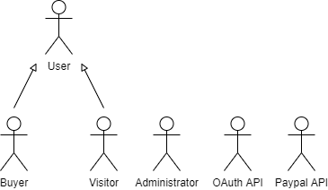

# ER: Requirements Specification Component

Our website aims to help customers get what they need when they need it during these troubling times with an enjoyable browsing experience.

## A1: Fneuc

This project intends to specify, develop and promote an information system available through the web for the management of an online store, in which users can buy products.  

We have a group of products to sell and we feel that a physical storefront wouldn't be enough to sell them. In addition, because of current circumstances, the physical contact required to sell our products in such a way has been heavily discouraged. Because of this, we are creating an online website to facilitate the transactions and increase the scope of potential buyers. We aim to create a platform with a responsive design, to give our uses the best browsing experience available in the market, allowing users to search through various categories, filter items, search them by name or choose from a recommended list.

Users are separated into three different types: system administrators and buyers, who have to register and log into the system, and guests. The user authentication can be done with an external API or using our website's authentication system, which requires an e-mail, a username and a password.

Buyers are able to acquire products and also rate/comment on them after purchase. This means that customers are able to use different types of filtering to obtain the best-rated products in accordance with their needs. Buyers are also able to charge their account with balance before committing to a purchase. Buyers also have a purchase history they can check, a favourite list (wishlist) they can manage and a recommended items list provided by the system based on their previous purchases and ratings. They can, at any time, set the delivery address, deposit money into their account before or during checkout using an external method, and update their credentials. Admins have full access and modification privileges, including removing ongoing sales, assign users as admins and viewing the customers' purchase history. Admins also have the ability to make discounts on selected items in stock. Guests are able to browse the catalogue but they are not allowed to make any purchase, rate or comment on any product as they need to log in first. Every user has access to an "about" page, contacts and FAQ so they can obtain information about the website and useful contacts.

The website provides a notification system that warns admins when a product goes out of stock and notifies a buyer when a wishlist item has been re-stocked or is on sale.

---

## A2: Actors and User stories

The Fneuc shop website provides a reliable shopping service for the general public with easy access. This section contains information about the actors involved, the functionalities and requirements.

  
Figure 1: Actors.

### 1. Actors

| Identifier    | Description                                                                                                                                                  | Example  |
|---------------|--------------------------------------------------------------------------------------------------------------------------------------------------------------|----------|
| Guest         | Unauthenticated user that can register himself or log into the website                                                                                                                   | n/a      |
| User          | Generic user that has access to public information                                                                                                           | n/a      |
| Buyer         | Authenticated user that can browse items, make purchases, add items to their favourites list, charge their account's balance and rate and comment item posts | lbaw2021 |
| Administrator | Authenticated user that can browse items, add/remove/edit items, manage comments and users, create new administrator accounts                                | lbaw2021 |
| OAuth API| External API that is used to register or log in a user                    | Google|
| Paypal API| Paypal API used for money transactions                    | Paypal|

### 2. User Stories

This section contains the user stories that will be considered during development.
                          
#### 2.1 **User**
| Identifier  | Name  | Priority  | Description  |
|---|---|---|---|
| US01  | Access Home  | high  | As a *User*, I want to access the website's homepage, so that I can know its general-purpose  |
| US02  | Access About Page  | high  | As a *User*, I want to access the 'About' page, so that I can see a complete and detailed description of the website  |
| US03  | See Contacts  | high  | As a *User*, I want to consult the website's contacts, so that I know how to contact the team if needed  |
| US04  | Search | high | As a *User*, I want to search for public information, like categories, items and prices, so that I can be informed about the platform's content |
| US05 | Logout | high | As a *User*, I want to be able to log out from my account, so that I can exit my account|
| US06  | Delete account | medium | As a *User*, I want to be able to delete my account, so that I can remove my account from the system |

#### 2.2 **Visitor**
| Identifier | Name                       | Priority | Description                                                                                  |
|------------|----------------------------|----------|----------------------------------------------------------------------------------------------|
| US11       | Sign-up                    | high     | As a *Visitor*, I want to be able to create a new account so that I'm able to authenticate myself |
| US12       | Sign-in                    | high     | As a *Visitor*, I want to be able to authenticate myself so that I'm able to buy products         |
| US13       | Administrator Sign-in      | high     | As a *Visitor*, I want to be able to sign-in as an administrator if I'm permitted to do so  |
| US14       | Sign-up using external API | low      | As a *Visitor*, I want to be able to create a new account using my existent Google account        |
| US15       | Sign-in using external API | low      | As a *Visitor*, I want to be able to sign-in using my Google account

#### 2.3 **Buyer**

| Identifier | Name                 | Priority | Description                                                                                                                 |
|------------|----------------------|----------|-----------------------------------------------------------------------------------------------------------------------------|
| US21       | See purchase history  | high     | As a *Buyer*, I want to see my purchasing history, so that I can see the products I have bought|
| US22       | Buy item             | high     | As a *Buyer*, I would like to purchase an item, so that I can obtain it                                                        |
| US23       | Rate item             | high     | As a *Buyer*, I would like to attribute a score to an item, so that other users can know my basic opinion of the item        |
| US24       | Comment item         | high     | As a *Buyer*, I would like to attach a comment to an item, so that other users can know my more complete opinion of the item |
| US25       | Add to cart          | high     | As a *Buyer*, I want to add an item to my cart, so that I am able to purchase it|
| US25       | Remove from cart          | high     | As a *Buyer*, I want to remove an item from my cart, so that I can reconsider my purchase before I finalize it.|
| US27  | Logout | high | As a *Buyer*, I want to be able to log out from my account, so that I can exit my account|
| US28       | Edit profile     | high| As a *Buyer*, I want to be able to edit my profile so that I can keep it up to date     |
| US29       | Recommended list| medium | As a *Buyer*, I would like to have a list of recommended items according to my history of products, so that I can easily find products that may be of my interest |
| US210       | Notifications| medium | As a *Buyer*, I would like to have notifications when my comment is answered, a product in my wishlist is re-stocked or put on sale, so that I can be on time to make the best purchases|
| US211       | See wish list        | medium   | As a *Buyer*, I want to see my wish list, so that I can decide if I want to purchase the items in it|
| US212       | Add to wish list        | medium   | As a *Buyer*, I want to add items to my wish list, so that I can purchase them easily in the future                          |
| US213       | Remove from wish list      | medium   | As a *Buyer*, I want to remove an item from my wish list, so that I can forget the item                                      |
| US214     | Remove comments      | medium   | As a *Buyer*, I want to be able to be able to delete my own comments so that I'm able to remove comments that I don't find usefull                        |
                                 

#### 2.4 **Administrator**

| Identifier  | Name  | Priority  | Description  |
|---|---|---|---|
| US31  | Manage products  | high  | As an *Administrator*, I want to manage product listings, so that I can create, remove and edit items|
| US32  | Create admin accounts  | high  | As an *Administrator*, I want to create administrator accounts, so that others can have administrator permissions  |
| US33  | Remove comments  | high  | As an *Administrator*, I want to remove comments, so that I can filter inappropriate language|
| US34  | Notification of items without stock | high | As an *Administrator*, I want to have a notification alert me when an item is out of stock, so that I can re-stock them as soon as possible|
| US35  | Logout | high | As an *Administrator*, I want to be able to log out from my account, so that I can exit my account|
| US36  | On sale| medium | As an *Administrator*, I want to have the ability to put items on sale, so that I can get attract uses to buy products that are not selling as well|
| US37  | Statistics of sold items | medium | As an *Administrator*, I want to have easy access to statistics of items filtered by different categories of users, so that I can have a better overview of what items sell better|
| US38  | Manage users accounts | medium | As an *Administrator*, I want to be able to ban and unban users, so that I'm able to remove problematic users|
| US39  | View Buyer's History | low | As an *Administrator*, I want to be able to view customer's purchase history, so that I can get a better understanding of what buyers look for the most|

### 3. Supplementary Requirements

In this annex are presented the project's business rules, technical requirements and restrictions.

#### 3.1. Business rules

| Identifier | Name              | Description |
|------------|-------------------|-------------|
| BR01       | Stock Mindfulness | A user can only buy an amount of an item lower or equal to its amount in stock.|
| BR02       | Out of stock           | A user can only purchase an item if it is in stock|
| BR03       |  Account balance check   |   A user can only purchase an item if they have enough money in the account to buy it. |
| BR04       |  Account deletion   |   When an account is deleted only his profile is deleted, his rating, comments and purchase history are kept in the system. |
| BR05      |  Decreasing stock   |   The item's stock is decreased when a buyer adds the item to his/her's shopping cart. |
| BR06      |  Removing from shopping cart |   If a buyer hasn't bought an item that is in his/her's shopping cart for two days the item is removed from the cart (checkout_date <= date_added_to_cart + 2 days) |
| BR07      |  Checkout with discounts applied |   If a buyer adds items with a discount to the cart, the discount will only be applied if it is still valid when doing the checkout |
| BR08      |  Adding to stock when removed from cart |   If a buyer removes an items from his/her's cart, the items are put back in stock |
| BR09      |  Removing money from an account |   If a buyer commits to checkout, only then is the money removed from his/her's account |

#### 3.2. Technical requirements

| Identifier | Name              | Description |
|------------|-------------------|-------------|
| TR01       | Availability | The system must be available most of the time everyday |
| TR02       | Accessibility | The system must be accessible for all users regardless of the used browser or physical limitations |
| TR03       | Usability | The platform should be of easy use and navigation |
| TR04       | Performance | The system should be as fast as possible to maximize user's experience |
| TR05       | Web application | The system should be implemented as a Web application with dynamic pages (HTML5, JavaScript, CSS3 and PHP) |
| TR06       | Portability | The server-side system should work across multiple platforms (Linux, Mac OS, Windows, etc.) |
| TR07       | Database | The system must use database management through PostgreSQL 9.4 |
| TR08       | Security | The system must use authentication, verification and secure payment systems to protect information from unauthorised access |
| TR09       | Robustness | The system must be able to handle and prevent errors |
| TR10       | Scalability | The system must be able to handle growth of users, actions and items. |
| TR11       | Ethics | The system must respect the ethical principles in software development (for example, the password must be stored encrypted to ensure that only the owner knows it) |
| TR12       | Manageability | The system should be easy to manage by administrators |

We consider that three of these requirements are more important and critical to the system. These requirements are TR05, TR07, and TR08, because the main purpose of the platform is to be a Web application that contains useful information, for and from the users, and that is safe to use.

#### 3.3. Restrictions

| Identifier | Name              | Description |
|------------|-------------------|-------------|
| C01       | Deadline | The system should be ready to be used at the end of the semester |

---

## A3: User Interface Prototype

> Brief presentation of the product.  
> Brief presentation of the artefact goals.

### 1. Interface and common features

> Screenshots highlighting the main elements of the interface, for desktop and mobile.

### 2. Sitemap

> Sitemap presenting the overall structure of the web application.  
> Each screen must be identified in the sitemap.  
> Multiple pages of the same screen (e.g. student profile in SIGARRA) are presented as page stacks.

### 3. Storyboards

> Storyboards for the main use cases of the system.  
> Do not include trivial use cases.

### 4. Interfaces

> Screenshots, structured in subsections, including a reference, a description and a URL to the working version.

#### UI01: Home

#### UI02: About

### 4. Hand-made materials

> Include digitization of the hand-made materials, particularly the wireflows. 

---

## Revision history

Changes made to the first submission:
1. Item 1
1. ...

***
GROUP21gg, DD/MM/2021

* Group member 1 name, email (Editor)
* Group member 2 name, email
* ...