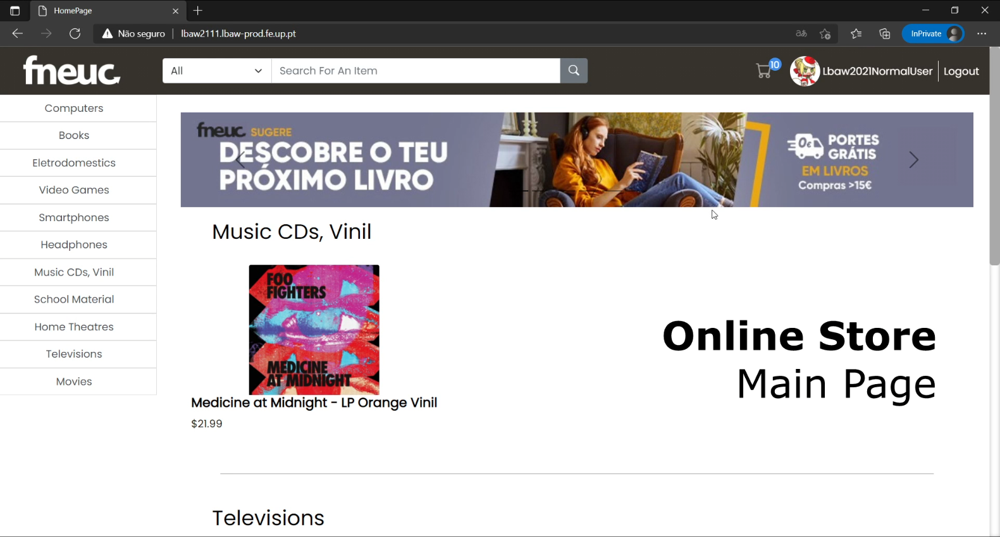

# PA: Product and Presentation

## A9: Product

Our website aims to help customers get what then need when they need it during these troubling times with an enjoyable browsing experience in a completely functional online store.

### 1. Installation

Source code: https://git.fe.up.pt/lbaw/lbaw2021/lbaw2111/-/tree/PA

Command to test the Docker image: 

```docker run -it -p 8000:80 -e DB_DATABASE="lbaw2111" -e DB_USERNAME="lbaw2111" -e DB_PASSWORD="CH342529" lbaw2111/lbaw2111```

### 2. Usage

URL to the product: http://lbaw2111.lbaw-prod.fe.up.pt  

#### 2.1. Administration Credentials

URL to the product's management page: http://lbaw2111.lbaw-prod.fe.up.pt/management 

| Email               | Password  |
| ------------------- | --------- |
| lbawAdmin@gmail.com | lbawadmin |

#### 2.2. User Credentials

| Type                            | Email                                 | Password   |
| ------------------------------- | ------------------------------------- | ---------- |
| basic account                   | normallogin@gmail.com                 | normaluser |
| PayPal sandbox personal account | sb-i474td6133157@personal.example.com | e(c?W>y4   |
| PayPal sandbox business account | sb-6os6a6029158@business.example.com  | \|G)x+Z<1  |

### 3. Application Help

In order to help our users know what does what we created some tool tips in important places. One example of contextual help is in the modal for charging the account's balance. Here the user can click a button that displays all he needs to know in order to successfully charge his account. This is also implemented to important user profile's fields and when creating a new account.


We also added FAQ and Contacts pages to the website in order to provide additional help to the users.


### 4. Input Validation

The input validation was implemented in many places in order to maintain the correct state of the database. It was used to make sure the password was strong enough, the e-mail is in the correct format and many other things. An example of input validation on the client side is the verification of the format the e-mail when changing it from the user profile. On top of that we also have server side validation, such as verifying if the e-mail is unique when creating a new account or changing the current e-mail.

```javascript
# Client Side
function validateEmail(email) {
    const re = /\S+@\S+\.\S+/;
    return re.test(String(email).toLowerCase());
}
```

```php
// Server Side
protected function validator(array $data)
{
    return Validator::make($data, [
        'username' => 'required|string|max:20|unique:users',
        'email' => 'required|string|email|max:255|unique:users',
        'password' => 'required|string|min:6|confirmed',
        'first_name' => 'required|string|max:255',
        'last_name' => 'required|string|max:255'
    ]);
}
```

### 5. Check Accessibility and Usability

Checklists results for our product:

- [Accessibility checklist](./checklists/accessibility.pdf)
- [Usability checklist](./checklists/usability.pdf)

### 6. HTML & CSS Validation

Validation results for HTML (https://validator.w3.org/nu/) and CSS (https://jigsaw.w3.org/css-validator/):

- [HTML validation results](https://git.fe.up.pt/lbaw/lbaw2021/lbaw2111/-/tree/master/validations/html)
- [CSS validation results](https://git.fe.up.pt/lbaw/lbaw2021/lbaw2111/-/tree/master/validations/css)

### 7. Revisions to the Project

**ER - Requirements specification**:

- Added user story US212
- Added user story US38
- Updated Authenticated user stories numeration
- Administrators also have access to normal Authenticated users, such as make purchases and add items to their wishlist

Throughout the project we made minor changes to the project's specification and, as such, we updated ER to reflect those changes. 

**EBD - Database Specification Component**:

- Added ON DELETE SET NULL to users atributes
- Added an enum to show the purchase state
- Fixed a duplicate trigger issue
- Added notify_admin trigger and corresponding function; Changed "Trigger" to "Rule" in rule01
- Added update_stock_remove_from_cart trigger and function; Changed transaction 1 procedure's name from 'remove_stock' to 'add_to_cart'
- Added remember_token to user table and reset_password table for "forgot password" feature
- Removed update_stock_remove_from_cart as it is not needed anymore
- Updated Transaction 2 and purchase table to support shipping option, and added shipping options table.
- Fixed add_to_cart procedure for cases when item was already in cart.


### 8. Implementation Details

#### 8.1. Libraries Used

- [**Laravel-PayPal**](https://github.com/srmklive/laravel-paypal) - Laravel plugin used to handle money transactions through use of the PayPal Orders API. This is used for the PayPal payment option on checkout and to recharge the user's account balance (User Page, Add balance - http://lbaw2111.lbaw-prod.fe.up.pt/userProfile). User is redirected to PayPal Sandbox website to pay.

#### 8.2 User Stories

| Identifier  | Name  | Module | Priority  | Team member | State |
|---|---|---|---|---|---|
| US11       | Sign-up                    | M1: Authentication and Profile | Mandatory | **Henrique Ribeiro** | 100% |
| US12       | Sign-in                    | M1: Authentication and Profile | Mandatory | **Henrique Ribeiro** | 100% |
| US13       | Administrator Sign-in      | M1: Authentication and Profile | Mandatory | **Henrique Ribeiro** | 100% |
| US37  | Logout | M1: Authentication and Profile | Mandatory | **Henrique Ribeiro**, Davide Castro | 100% |
| US313 | View  users profile | M1: Authentication and Profile | Mandatory | **Henrique Ribeiro**, Davide Castro | 100% |
| US314 | View users buy history | M1: Authentication and Profile | Mandatory | **Henrique Ribeiro**, Davide Castro | 100% |
| US210      | Recharge account balance     | M1: Authentication and Profile | Mandatory | **Davide Castro**, Henrique Ribeiro | 100% |
| US07  | Delete account | M1: Authentication and Profile | Mandatory | **Diogo Rosário**, Henrique Ribeiro | 100% |
| US01  | Access Home  | M2: Products and Categories | Mandatory | **Henrique Ribeiro**, Davide Castro | 100% |
| US04  | Search items | M2: Products and Categories | Mandatory | **Henrique Ribeiro**, Davide Castro  | 100% |
| US06  | View items | M2: Products and Categories | Mandatory | **Henrique Ribeiro**, Davide Castro  | 100% |
| US05  | Filter items | M2: Products and Categories | Mandatory | **João Cardoso**, Davide Castro  | 100% |
| US31  | Create items  | M3: Management | Mandatory | **Diogo Rosário**, Henrique Ribeiro | 100% |
| US32  | Remove items  | M3: Management | Mandatory | **Diogo Rosário**, Henrique Ribeiro | 100% |
| US33  | Edit items  | M3: Management | Mandatory | **Diogo Rosário**, Henrique Ribeiro | 100% |
| US34  | Create admin accounts  | M3: Management | Mandatory | **João Cardoso**, Davide Castro | 100% |
| US38 | View all unbanned users | M3: Management | Mandatory | **Henrique Ribeiro**, Davide Castro | 100% |
| US311 | Ban user accounts | M3: Management | Mandatory | **Davide Castro**, Diogo Rosário | 100% |
| US312 | Unban user accounts | M3: Management | Mandatory | **Diogo Rosário**, Davide Castro | 100% |
| US35  | Remove comments  | M5: Products and Reviews | Mandatory | **Henrique Ribeiro**, Davide Castro | 100% |
| US39 | Put item on sale | M5: Products and Reviews | Mandatory | **Diogo Rosário**, Davide Castro | 100% |
| US25      | Add to cart          | M6: Wishlist and Cart | Mandatory | **Davide Castro**, Henrique Ribeiro | 100% |
| US26      | Remove from cart          | M6: Wishlist and Cart | Mandatory | **Davide Castro**, Henrique Ribeiro | 100% |
| US27      | Checkout cart          | M6: Wishlist and Cart | Mandatory | **Davide Castro** | 100% |
| US211 | View Cart | M6: Wishlist and Cart | Mandatory | **Henrique Ribeiro** | 100% |
| US28 | Logout | M1: Authentication and Profile | Important | **Henrique Ribeiro** | 100% |
| US29      | Edit profile     | M1: Authentication and Profile | Important | **João Cardoso**, Davide Castro | 100% |
| US212     | View product recommendations | M1: Authentication and Profile | Important | **Henrique Ribeiro** | 100% |
| US213     | View notifications | M1: Authentication and Profile | Important | **Henrique Ribeiro**, Diogo Rosário | 100% |
| US21       | View purchase history  | M1: Authentication and Profile | Important | **Davide Castro**, Henrique Ribeiro | 100% |
| US22      | Rate item             | M2: Products and Categories | Important | **Davide Castro**, Henrique Ribeiro | 100% |
| US23      | Comment item         | M2: Products and Categories | Important | **Davide Castro**, Henrique Ribeiro | 100% |
| US24    | Remove comment      | M2: Products and Categories | Important | **Davide Castro**, Henrique Ribeiro | 100% |
| US36  | View notifications of items without stock | M3: Management | Important | **João Cardoso**, Davide Castro | 100% |
| US02  | Access About Page | M4: Static Pages | Important | **Henrique Ribeiro**, Davide Castro  | 100% |
| US03  | See Contacts | M4: Static Pages | Important | **Henrique Ribeiro**, Davide Castro  | 100% |
| US214 | View wish list | M6: Wishlist and Cart | Important | **Henrique Ribeiro** | 100% |
| US215     | Add to wish list        | M6: Wishlist and Cart | Important | **Davide Castro** | 100% |
| US216     | Remove from wish list      | M6: Wishlist and Cart | Important | **Davide Castro** | 100% |


---


## A10: Presentation

### 1. Product presentation

**Fneuc** is an online store where users can purchase a variety of products. There are 3 types of users. Firstly, the guests (unauthenticated users), then the authenticated users and finally, the admins. Our registered users' main pages contain personalized suggestions, based on their purchase histories. Then, they can select an item, or search using a search box, multiple filters and sorting methods. Whenever they look at an item, they can add/edit/remove (their own) comments, rate the item from 1 to 5 stars, and add it to their cart, although guests can also use the cart. In order for a user to complete account registration, they must click the link in the e-mail they receive when they register an account in order to verify their e-mail address. The user, when logged in, can checkout the items in their cart and pay through PayPal. Alternatively, the user can also add balance through PayPal and use that balance to pay for their items. Admins are able to do anything a user can and can also create/edit new items, apply/remove discounts from them, ban a user and promote a user to admin.

URL to the product: http://lbaw2111.lbaw-prod.fe.up.pt  

### 2. Video presentation



Presentation video: [lbaw2111.mp4](https://drive.google.com/file/d/1evdek220yzSDyOTkV5PxV1FVgK1tV6g5/view?usp=sharing)


---


## Revision history

No revisions.

***
GROUP2111, 08/06/2021

* Diogo Guimarães do Rosário, [up201806582@edu.fe.up.pt](mailto:up201806582@fe.up.pt) 
* Henrique Melo Ribeiro, [up201806529@edu.fe.up.pt](mailto:up201806529@fe.up.pt)
* Davide António Ferreira Castro, [up201806512@edu.fe.up.pt](mailto:up201806512@fe.up.pt) (Editor)
* João Alexandre Lobo Cardoso, [up201806531@edu.fe.up.pt](mailto:up201806531@fe.up.pt)

